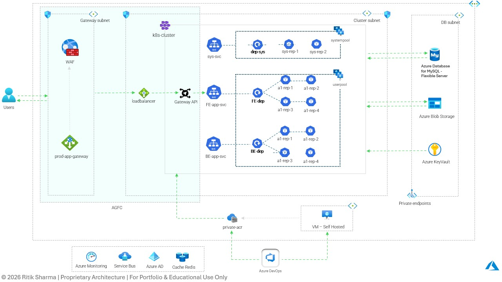

# Azure Application Gateway for Containers (AGFC) & Gateway API Reference Architecture

> Enterprise reference architecture demonstrating modern Kubernetes ingress using Azure Application Gateway for Containers (AGFC) and Gateway API.

---

## Overview

This architecture illustrates a modern ingress solution for Azure Kubernetes Service (AKS) using Azure Application Gateway for Containers (AGFC) together with the Kubernetes Gateway API.

The design enables secure, scalable, and cloud-native traffic management while separating ingress responsibilities from application workloads.

---

## Architecture Highlights

- Azure Kubernetes Service (AKS)
- Azure Application Gateway for Containers (AGFC)
- Kubernetes Gateway API
- Web Application Firewall (WAF)
- Azure DevOps CI/CD
- Private Azure Container Registry
- Azure Key Vault
- Azure Database for MySQL
- Azure Blob Storage
- Azure Cache for Redis
- Azure Service Bus
- Azure Active Directory
- Azure Monitor
- Private Endpoints

---

## Traffic Flow

Client

↓

Web Application Firewall

↓

Azure Application Gateway

↓

Gateway API

↓

Frontend Service

↓

Backend Services

↓

Application Pods

The Gateway API enables modern Kubernetes-native traffic routing while Azure Application Gateway for Containers provides secure ingress management.

---

## Infrastructure Components

### Networking

- Azure Virtual Network
- Gateway Subnet
- Cluster Subnet
- Database Subnet
- Private Endpoints

---

### Kubernetes Platform

The AKS cluster contains:

- Dedicated System Node Pool
- Dedicated User Node Pool
- Gateway API
- Frontend Services
- Backend Services
- Kubernetes Deployments

---

### Ingress

The architecture uses:

- Azure Application Gateway for Containers (AGFC)
- Kubernetes Gateway API
- Layer 7 Routing
- HTTPS Termination
- Host-based Routing
- Path-based Routing

---

### Security

Security controls include:

- Azure Key Vault
- Private Azure Container Registry
- Azure Active Directory
- Web Application Firewall
- Private Endpoints
- Network Segmentation

---

### CI/CD

Continuous Delivery is implemented using Azure DevOps.

Deployment Pipeline

Azure DevOps

↓

Self Hosted Agent

↓

Private Azure Container Registry

↓

AKS

---

### Monitoring

Monitoring capabilities include:

- Azure Monitor
- Application Metrics
- Log Collection
- Health Monitoring

---

## Design Goals

- Kubernetes-native Ingress
- Modern Gateway API
- Production-grade Security
- High Availability
- Cloud-native Networking
- Scalable Platform Architecture

---

## Target Workloads

- Enterprise Applications
- Microservices
- APIs
- SaaS Platforms
- Cloud-native Workloads

---

## Technologies

Azure • AKS • AGFC • Gateway API • Kubernetes • Azure DevOps • Docker • Azure Key Vault • Azure Monitor • Azure Service Bus • Azure Database for MySQL • Redis

---

## Why Gateway API?

Gateway API provides a more expressive and extensible networking model than traditional Kubernetes Ingress by offering:

- Standardized traffic management
- Role-oriented resource ownership
- Improved routing capabilities
- Extensible API model
- Better multi-team collaboration

---

# Azure AKS Reference Architecture

📄 Download the detailed architecture:

**Azure-AGFC-GatewayAPI-Reference-Architecture.pdf**

## Disclaimer

This architecture is intended as a reference implementation for learning, portfolio demonstration, and architectural discussions.

It is not an exact representation of any client environment.

---

© 2026 Ritik Sharma. All Rights Reserved.