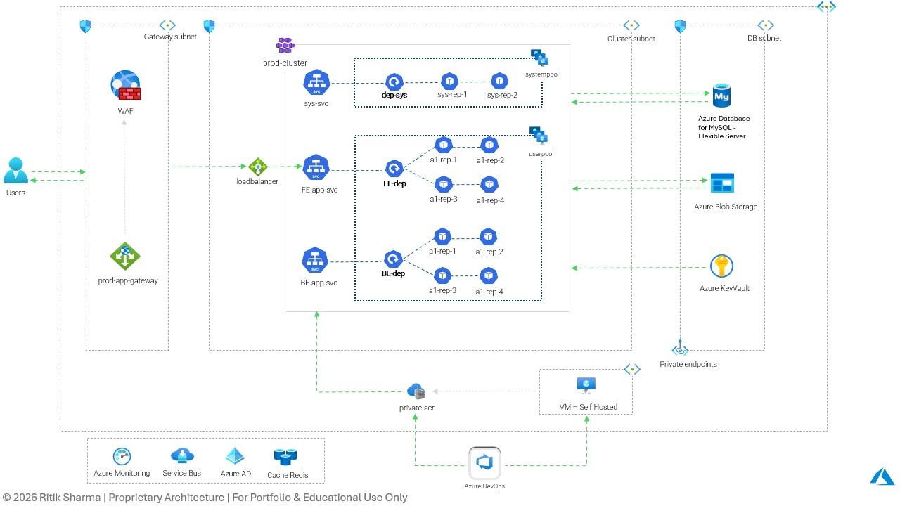

# Azure AKS Reference Architecture

> Production-ready Azure Kubernetes Service (AKS) reference architecture demonstrating a secure, scalable, and highly available cloud-native application deployment.

---

## Overview

This reference architecture showcases a production-grade deployment model for hosting containerized applications on Azure Kubernetes Service (AKS).

The architecture follows enterprise cloud best practices by incorporating secure networking, infrastructure isolation, CI/CD automation, container image management, secret management, monitoring, and managed Azure services.

---

## Architecture Highlights

- Production Azure Kubernetes Service (AKS)
- Dedicated System & User Node Pools
- Azure Application Gateway with Web Application Firewall (WAF)
- Azure DevOps CI/CD
- Self-hosted Build Agent
- Private Azure Container Registry (ACR)
- Azure Key Vault
- Azure Database for MySQL
- Azure Blob Storage
- Azure Service Bus
- Azure Cache for Redis
- Azure Monitor
- Azure Active Directory
- Private Endpoints
- Secure Virtual Network Segmentation

---

## Infrastructure Components

### Networking

- Azure Virtual Network
- Gateway Subnet
- AKS Cluster Subnet
- Database Subnet
- Private Endpoint Integration

Network segmentation ensures secure communication while minimizing public exposure.

---

### Kubernetes Platform

The AKS cluster consists of:

- Dedicated System Node Pool
- Dedicated User Node Pool
- Frontend Deployment
- Backend Deployment
- System Services
- Kubernetes Services
- Internal Load Balancer

This separation improves workload isolation and scalability.

---

### Security

The platform implements several security best practices:

- Azure Key Vault for Secret Management
- Private Azure Container Registry
- Azure Active Directory Integration
- Web Application Firewall (WAF)
- Private Endpoints
- Network Segmentation

---

### CI/CD

Application deployments are automated using Azure DevOps.

Deployment Flow:

Azure DevOps

↓

Self Hosted Agent

↓

Private Azure Container Registry

↓

Azure Kubernetes Service

---

### Data Layer

Applications communicate securely with:

- Azure Database for MySQL
- Azure Blob Storage
- Azure Cache for Redis
- Azure Service Bus

using private networking.

---

### Monitoring

Platform observability is achieved using:

- Azure Monitor
- Application Logs
- Metrics Collection
- Health Monitoring

---

## Design Goals

- High Availability
- Secure Networking
- Horizontal Scalability
- Production Readiness
- Infrastructure Isolation
- Enterprise Security
- Cloud-native Design

---

## Target Use Cases

- Enterprise Web Applications
- Microservices
- Internal Business Platforms
- SaaS Applications
- API Platforms

---

## Technologies

Azure • Kubernetes • AKS • Azure DevOps • Docker • Azure Key Vault • Azure Database for MySQL • Azure Blob Storage • Azure Monitor • Azure Service Bus • Redis • WAF

---

# Azure AKS Reference Architecture

📄 Download the detailed architecture:

**Azure-AKS-Reference-Architecture.pdf**

## Disclaimer

This architecture is intended as a reference implementation for learning, portfolio demonstration, and architectural discussions.

It is not an exact representation of any client environment.

---

© 2026 Ritik Sharma. All Rights Reserved.